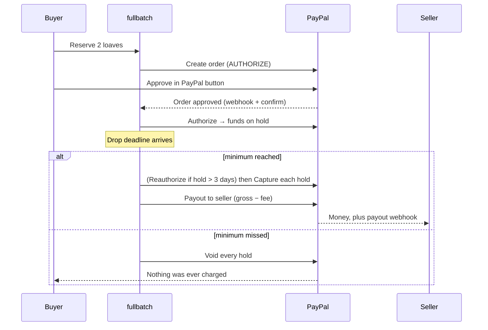

# fullbatch

**Neighborhood preorder drops, powered by PayPal.** A seller posts a drop ("30 loaves of sourdough, ready Saturday, but only if 12 people want one"). Neighbors reserve and **PayPal places a hold** on their money. If the drop reaches its minimum by the deadline, every hold is **captured** and the seller is **paid out**. If not, every hold is **voided**: nobody pays, nothing gets made, nothing needs refunding.

Live demo (PayPal sandbox, test money only): https://fullbatch.onrender.com

## Why PayPal is the whole product

The core promise, "you pay only if enough neighbors join", is not a feature bolted onto a checkout. It is PayPal's **authorize → capture / void** model, used end to end.

| PayPal capability | Where fullbatch uses it | Code |
|---|---|---|
| Log in with PayPal (OIDC) | Sign-in; a seller must have a PayPal-verified account | `backend/app/auth.py`, `paypal.py` |
| Orders v2, `intent: AUTHORIZE` | Reserving creates an order that holds funds | `paypal.create_order` |
| JS SDK Smart Payment Buttons | Buyers approve in a popup inside the Reserve dialog; full-page redirect is the fallback | `frontend/src/components/PayPalButton.tsx` |
| Payments v2 · reauthorize | Holds older than PayPal's 3-day honor period are renewed before capture | `drops._refresh_old_hold` |
| Payments v2 · capture | Drop filled: every hold is captured | `drops._process_holds` |
| Payments v2 · void | Drop missed: every hold is released | `drops._process_holds` |
| Payouts API | Seller is paid the captured total minus a platform fee, once per drop | `backend/app/payouts.py` |
| Webhooks + signature verification | Order approved, capture/refund/void, payout results | `main._handle_webhook` |
| Idempotency (`PayPal-Request-Id`, `sender_batch_id`) | Retries and crashes can never double-hold, double-capture or double-pay | everywhere above |



Every order shows its own PayPal timeline (hold id, expiry, capture id, each API call), and the app explains all of this at `/built-on-paypal`.

## Also in the box

- **Seller dashboard on AG Grid's AG Studio**, with a custom **Drop planner agent** (Studio Agent Framework) that reads past drops and recommends the next one. The numbers come from code; the model only explains them.
- **Chat assistants** for buyers and sellers (optional dock), Gemini with Groq fallback.
- **Location-based selling**: pickup or delivery within a radius, neighborhood map, buyer location never leaves the browser.
- **Email verification** codes, verified-seller gate, row-locked stock so two buyers can't take the last unit.

## Try it (sandbox)

1. Open the live demo and **Sign in with PayPal** using a sandbox *Personal* account (developer.paypal.com → Testing tools → Sandbox accounts).
2. Browse drops, reserve, and approve with a sandbox buyer. Your order page shows the PayPal hold.
3. As a seller, create a drop (a verified PayPal account is required), then use **Close now (demo)** to settle it instantly. It captures, pays out, and shows the payout.

No real money moves: the app refuses to talk to anything but PayPal's sandbox.

## Run it locally

```bash
cd backend && python3 -m venv .venv && source .venv/bin/activate && pip install -r requirements.txt
cd ../frontend && npm install
cd .. && cp .env.example .env     # fill in sandbox PAYPAL_CLIENT_ID / PAYPAL_CLIENT_SECRET and keys
./dev.sh                          # database + API on :8000 + app on :5173 (dev sign-in, since PayPal login needs https)
```

Tests (real Postgres, fake PayPal): `cd backend && python -m pytest tests -q`

Deploying (Neon + Render, free tiers): see [DEPLOY.md](DEPLOY.md).

## How it is built

React 19 + Vite + TypeScript frontend; FastAPI + SQLAlchemy + Postgres backend; one Docker image serves both. The money rules (settle once, capture or void each hold exactly once, pay once) are idempotent and tested against a real database, including crash-midway recovery.

## Settings that matter

| Variable | Meaning |
|---|---|
| `PAYPAL_CLIENT_ID` / `PAYPAL_CLIENT_SECRET` | Sandbox app credentials |
| `PAYPAL_WEBHOOK_ID` | Webhook id from the PayPal dashboard |
| `PLATFORM_FEE_PERCENT` | Share fullbatch keeps from each filled drop (default 5) |
| `DEMO_MODE=1` | Shows the Close-now button for demos |
